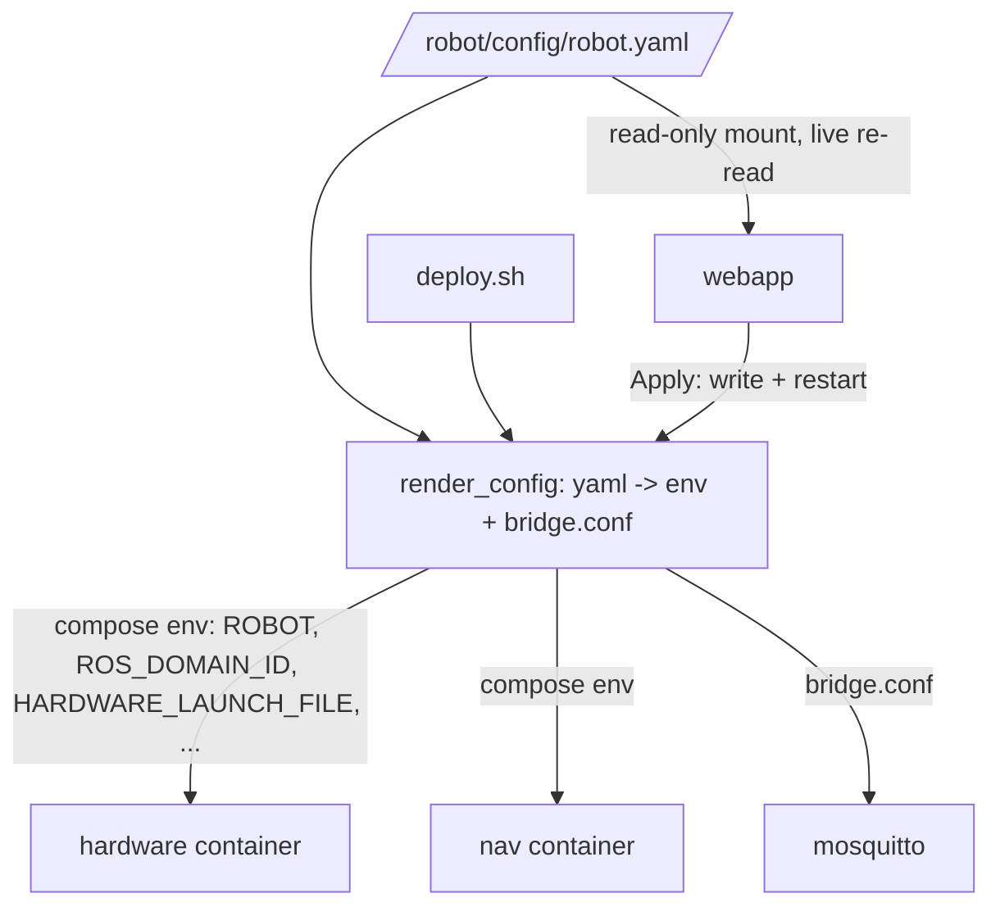

# Design: Web-based robot configuration

**Status:** Draft for review
**Scope:** Configure a robot host (type, name, instance, ROS domain, and runtime
settings) from a config page in the webapp, backed by a single source of truth
on the host, applied with one click.
**Non-goal:** Fleet-wide / central configuration — explicitly deferred (§9.4).

## Decisions (resolved)

- **Auth = single shared operator login.** No per-user RBAC for now. See §5.
- **`robot.yaml` retires `.env`.** `.env` is no longer a hand-authored file;
  `robot.yaml` is the sole source, `render_config` compiles it to whatever
  compose needs. See §4.
- **Fleet integration = later.** The robot host is authoritative for itself;
  no push-from-fleet in this design. See §9.4.

---

## 1. Summary

Today a robot's identity is encoded in **three** places that must be kept in
sync by hand or by `deploy.sh`:

- `.env` (host, gitignored) — `ROBOT`, `ROBOT_INSTANCE`, `ROS_DOMAIN_ID`,
  `LAUNCH_FILE`, image versions, `INPUT_GID`.
- `app_config.<instance>.json` (baked into the webapp image) — MQTT topics,
  velocities, limits, map, drive-type, wheel set, docker-log container.
- `docker/mosquitto/bridge.conf` (rendered from a template) — topic routes,
  bridge client-id.

We replace this with **one host-mounted file, `/robot/config/robot.yaml`**, that
both the webapp and `deploy.sh` read and write. A **config page** in the webapp
edits it; **"Apply"** re-renders the derived artifacts and restarts the affected
containers via the Docker socket.

Two structural facts drive the design:

1. **The webapp has no persistent storage today** (SQLite is recreated on every
   image update — no volume). Any web-set config **must** live on a host volume
   or it is lost on the next `WEBAPP_VERSION` bump.
2. **Identity is start-time config.** A running DDS node can't change its
   `ROS_DOMAIN_ID`; the hardware container picks its launch file at boot. So the
   page can *store* these live, but *applying* them means **restarting** the ROS
   containers. This is inherent — the UI must be honest about it.

The webapp stays a **separate container** (control plane), never merged into the
hardware container — see §7.

---

## 2. Single source of truth: `/robot/config/robot.yaml`

Lives on the host next to `/robot/data/maps`. Mounted **read-write** into the
webapp and **read-only** into the ROS containers (or consumed indirectly, §4).

```yaml
# /robot/config/robot.yaml — one file per robot host.
schema_version: 1

identity:
  robot: cmexamini             # type -> launch/description/config selection
  instance: cmexamini-001      # MQTT id -> cmeresearch/<instance>/... prefix
  name: "Mini #1"              # display name (webapp header)

ros:
  domain_id: 13                # DDS domain (isolate robots on a shared subnet)
  nav_launch: cmexamini_nav_mapping.launch.py   # mapping | localization
  robot_env: house

images:                        # image tags (what deploy.sh pins)
  robot_version: jazzy-0.7.4
  webapp_version: jazzy-0.5.3

host:                          # host-detected at provisioning (was in .env)
  input_gid: 995               # 'input' group GID for joystick access

mqtt:
  broker_url: localhost
  broker_port: 1883
  remote_broker: 10.8.0.1:1883

# ---- Runtime (hot-applicable) — webapp re-reads without a container restart ----
control:
  drive_type: diff
  limits:      { max_linear_x: 0.3, max_linear_y: 0.0, max_angular_z: 1.0 }
  velocities:  { forward: 0.2, backward: -0.2, left: 0.0, right: 0.0, rotate_cw: -0.5, rotate_ccw: 0.5 }
  motor_feedback_wheels: [front_right, rear_left]
  docker_log_container: cmexamini-hardware

map:
  map_id: cmexamini_house
  width: 20, height: 20, resolution: 0.05, origin_x: -10.0, origin_y: -10.0
```

MQTT topic strings are **no longer spelled out** — the webapp derives
`cmeresearch/<identity.instance>/…` in code. That removes the most error-prone
part of today's per-instance JSON.

---

## 3. Settings tiers (this is the whole UX contract)

| Tier | Fields | Apply |
|---|---|---|
| **Boot-time** | `identity.*`, `ros.domain_id`, `ros.nav_launch`, `images.*` | Write file → **restart hardware/nav** (UI shows "requires restart") |
| **Runtime** | `control.*`, `map.*` | Written + webapp re-reads live; **no restart** |

The page groups fields by tier and shows a persistent "changes pending restart"
banner when boot-time fields are dirty.

---

## 4. Who reads robot.yaml, and how



**Key principle: one translator, two callers.** The logic that turns
`robot.yaml` into compose env + a rendered `bridge.conf` lives in **one shared
script** (`render_config`, e.g. a small Python module). Both `deploy.sh` and the
webapp's Apply action call it, so CLI and web can never drift.

- **Hardware / nav containers** keep consuming **env** (`ROBOT`,
  `ROS_DOMAIN_ID`, `HARDWARE_LAUNCH_FILE`, `LAUNCH_FILE`) — the contract we
  already built. `robot.yaml` is the *authoring* source that `render_config`
  compiles into that env. (We do **not** teach the ROS entrypoints to parse
  YAML — env stays the container interface.)
- **Webapp** reads `robot.yaml` directly (replaces the baked
  `app_config.<instance>.json`) and re-reads it when runtime settings are saved.
- **`deploy.sh`** reads `robot.yaml` for identity/versions instead of `.env`.

**`.env` is retired as an authored file.** `robot.yaml` is the sole source.
Because `docker compose` still needs `${VAR}` interpolation at invocation, both
`deploy.sh` and the webapp call `render_config` to emit a **generated env-file**
(gitignored, never hand-edited — passed via `docker compose --env-file`) plus the
rendered `bridge.conf`. Host-detected values that used to live in `.env`
(`INPUT_GID`) move into `robot.yaml`'s `host:` block, populated at provisioning.
`setup.sh` is replaced by a provisioning step that writes the initial
`robot.yaml`. A one-shot **`.env → robot.yaml` migration** runs on first deploy
of the new scheme for existing hosts.

---

## 5. "Apply & Restart" — one-click via Docker socket

The webapp image **already ships the `docker` CLI** and already mounts
`/var/run/docker.sock` (`:ro` today). Apply flow:

1. **Validate** the submitted config (schema + ranges + enum of known robot
   types/launch files). Reject unknown robot types early.
2. **Write** `robot.yaml` atomically (temp file + rename) to the host volume.
3. **Render** derived artifacts via `render_config` (compose env file +
   `bridge.conf`).
4. **Restart** the affected containers so new **env** takes effect:
   `docker compose -f docker-compose.prod.yml up -d` (a plain `restart` re-uses
   old env — we need `up -d` to recreate with the new env).

To do step 4 the webapp needs, beyond today:

- `docker.sock` mounted **read-write** (currently `:ro`).
- The **compose file + deploy dir** bind-mounted in (so `docker compose` has
  project context), or a pinned `--project-name`.

### ⚠️ Security — this is the crux, gate it hard
`docker.sock` rw is **root-equivalent on the host**, exposed by a Django app that
is reachable on the LAN/VPN and whose control endpoints are **currently
unauthenticated**. Required mitigations before this ships:

- **Auth = single shared operator login** on all config/apply endpoints. The
  webapp already has Django's auth stack (`accounts.CustomUser`,
  `AuthenticationMiddleware`); add one operator account and `login_required` on
  the config + apply views. No per-user RBAC. Provision the account at first
  boot: `render_config`/provisioning seeds the user and forces a password set on
  first login (or takes an initial password from a provisioning secret — never
  stored plaintext in `robot.yaml`). **Trade-off of shared creds:** the audit
  log can only attribute an Apply to "the operator login", not an individual —
  acceptable for a single-operator robot; revisit if that changes.
- **Least-privilege socket.** Prefer a **docker-socket-proxy** sidecar that
  exposes only `POST /containers/*/restart` + the compose calls we need, instead
  of the raw rw socket. The webapp talks to the proxy; the proxy holds the sock.
- **Confirmation + audit.** Boot-time Apply requires an explicit confirm; log
  who applied what and when (persist to the config volume).

### Recommended variant worth a look: host-side apply agent
An even safer shape that keeps the **same one-click UX**: the webapp only
*writes* `robot.yaml` + an "apply requested" marker; a tiny host unit (systemd
**path** unit watching the file) runs `deploy.sh`. The webapp then needs **no**
docker privileges at all, and `deploy.sh` stays the single apply path. Cost: one
host unit to install during provisioning. I'd recommend this over raw rw-sock;
noted here for the decision. (Chosen approach in this doc = rw sock + proxy +
auth; swapping to the agent changes only §5 step 4.)

---

## 6. First boot / provisioning

Robot-agnostic services (**webapp + mosquitto**) always start. Robot-specific
services (**hardware + nav**) are gated on a valid `robot.yaml`.

- No `robot.yaml` → webapp boots in **setup mode**: serves only the config page;
  hardware/nav not started.
- Operator picks robot type / instance / domain → **Apply** → `render_config`
  runs → hardware+nav come up.
- `deploy.sh` seeds a default `robot.yaml` (as `setup.sh` seeds `.env` today), so
  a pure-CLI deploy still works with zero web interaction.

---

## 7. Why the webapp stays a separate container

- **Independent versioning** (`WEBAPP_VERSION` vs `ROBOT_VERSION`) — webapp
  hotfixes without a ROS rebuild.
- **Restart isolation** — a UI reload never touches real-time control.
- **Blast radius** — hardware is `privileged`; keep that away from the web tier.
- **Provisioning** — the webapp must serve the config page *before* the robot
  type is known; a webapp inside the hardware container is a chicken-and-egg
  (hardware can't start without config, config page can't serve without
  hardware). Separate + always-on webapp = natural control plane.

"Always ships" is already satisfied: the webapp is a non-profile compose service.

---

## 8. Migration plan (phased, each independently shippable)

| Phase | Delivers | Risk |
|---|---|---|
| **0. Foundation** | `robot.yaml` schema + `render_config` shared translator; `deploy.sh` reads `robot.yaml` (falls back to `.env`); host config **volume** mounted into webapp | Low — no behavior change; cmexaiii identical |
| **1. Webapp reads it** | Webapp loads `robot.yaml` (replaces baked `app_config.<instance>.json`); derives topics from `instance`; runtime settings re-read live | Low/med — webapp config path change |
| **2. Config page (runtime)** | Read/write page for `control.*` + `map.*`; no restart needed; **auth added** | Med — first auth-gated write path |
| **3. Config page (boot-time) + Apply** | Boot-time fields + one-click Apply (rw sock + proxy, or host agent); confirm + audit | **High** — privileged restart from web; needs security review |
| **4. Provisioning mode** | First-boot setup mode; `deploy.sh` seeds default `robot.yaml` | Med |

Backward compatible throughout: `deploy.sh --robot/--instance` keeps working
(writes `robot.yaml`); cmexaiii unchanged.

---

## 9. Risks & open questions

1. ~~**Auth model.**~~ **Resolved: single shared operator login** (§5). Still
   open: is the shared password managed manually, or eventually via the org's
   Keycloak? (Out of scope now; shared local account for the first cut.)
2. ~~**`.env` fate.**~~ **Resolved: `robot.yaml` retires `.env`** (§4);
   `render_config` emits a generated env-file for compose; a one-shot migration
   converts existing hosts.
3. **Concurrency.** Webapp and `deploy.sh` can both write `robot.yaml`. Need a
   lock / atomic write + "last write wins" story, and the webapp should re-read
   before edit. *(Still open.)*
4. ~~**Fleet relation.**~~ **Deferred.** The robot host is authoritative for
   itself; no push-from-`cmeresearch_fleetmanager` in this design. Revisit as a
   later epic — `robot.yaml` being the on-robot source of truth is compatible
   with a future fleet layer that renders/pushes it.
5. **Restart safety.** Applying boot-time changes drops the robot's ROS graph for
   ~30s (hardware healthcheck `start_period`). The UI must warn and ideally
   refuse mid-mission (check `nav_status`/state machine before restart).
   *(Still open — needs a UX rule.)*
6. **Which fields are truly web-settable.** LiDAR port, `INPUT_GID`, brick
   positions are *physical* facts, not casual settings — keep them in
   launch/config or the `host:` block (read-only in the UI), not free-form web
   fields. Decide the exact boundary. *(Still open.)*
7. **Socket-proxy vs host-agent for Apply.** Chosen: rw sock behind a
   docker-socket-proxy (§5). The host-agent variant remains a recommended
   alternative to evaluate before Phase 3 ships. *(Decision pending Phase 3.)*

---

## 10. Recommendation

Proceed **Phase 0 → 1 first** (the `robot.yaml` foundation + shared translator +
webapp read-path + persistent volume). It's low-risk, removes today's triple
config duplication immediately, and is a prerequisite for everything else — with
**no** new privileges. Treat **Phase 3 (privileged Apply)** as a separate,
security-reviewed change, and seriously consider the **host-agent** apply variant
over raw rw-socket.
